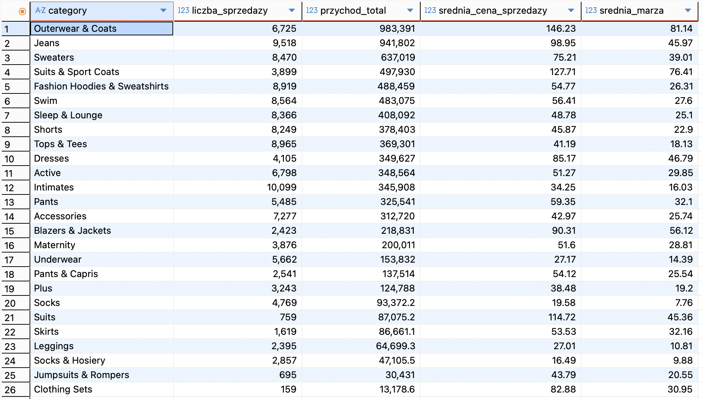
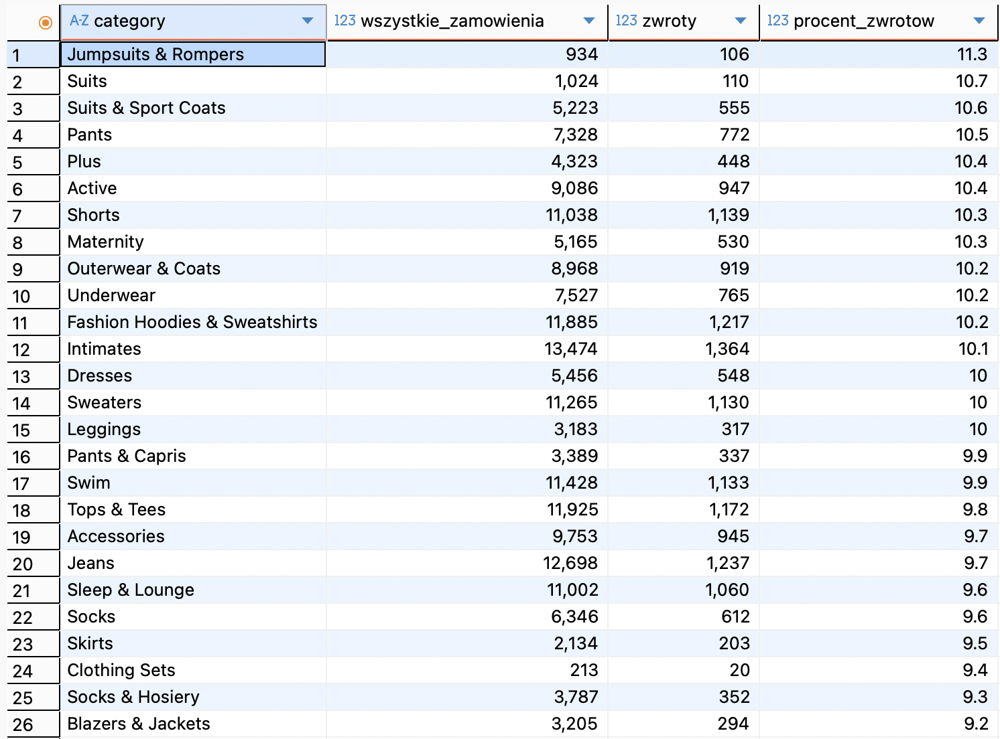
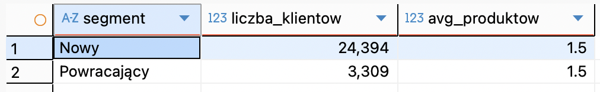
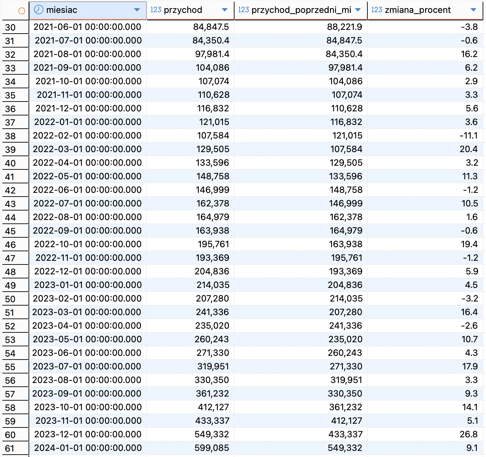

# 🛒 Analiza Danych E-commerce (PostgreSQL)

**Opis:** Eksploracyjna analiza danych (EDA) zbioru e-commerce, ze szczególnym uwzględnieniem wyników sprzedaży produktów, segmentacji klientów oraz trendów przychodowych, wykonana przy użyciu języka SQL (PostgreSQL).

**Dataset:** [Looker Ecommerce BigQuery Dataset – Kaggle](https://www.kaggle.com/datasets/mustafakeser4/looker-ecommerce-bigquery-dataset)

## 📌 O Projekcie
Repozytorium zawiera kompleksową analizę danych testowej bazy sklepu e-commerce. Celem projektu jest wyciągnięcie użytecznych wniosków biznesowych dotyczących poszczególnych kategorii produktów, zachowań zakupowych klientów i wyników sprzedaży w czasie.

## 📂 Struktura Repozytorium
* `queries.sql` - Zawiera wszystkie zapytania SQL użyte do ekstrakcji, agregacji i segmentacji danych.
* `data/` - Surowe pliki CSV użyte do analizy:
    * `distribution_centers.csv`
    * `events_small.csv` *(Uwaga: Jest to skrócona próbka oryginalnego zbioru ze zdarzeniami, dostosowana do limitów wielkości plików na portalu GitHub)*
    * `inventory_items.csv`
    * `order_items.csv`
    * `orders.csv`
    * `products.csv`
    * `users.csv`
* `screenshots/` - Wyeksportowane wyniki zapytań SQL:
    * `01_category_revenue_margin.png`
    * `02_category_returns.png`
    * `03_customer_segments.png`
    * `04_monthly_revenue_mom.png`

## 📊 Kluczowe Obszary Analizy

### 1. Wyniki Kategorii (Przychód i Marża)
Analiza, które kategorie produktów generują najwyższy całkowity przychód, połączona z porównaniem ich średnich marż zysku w celu zidentyfikowania najbardziej dochodowych działów sklepu.

### 2. Wskaźniki Zwrotów według Kategorii
Identyfikacja kategorii produktów o najwyższym odsetku zwrotów. Ta metryka jest kluczowa do wychwycenia potencjalnych problemów z jakością, nietrafioną rozmiarówką lub błędnym opisem, które generują zbędne koszty operacyjne dla firmy.

### 3. Segmentacja Klientów
Klasyfikacja klientów na podstawie częstotliwości ich zamówień, pozwalająca lepiej zrozumieć strukturę bazy użytkowników:
* **Nowy:** 1 zamówienie
* **Powracający:** 2-5 zamówień
* **VIP:** >5 zamówień

### 4. Miesięczny Przychód i Wzrost MoM
Śledzenie całkowitego przychodu w ujęciu miesięcznym (Miesiąc do Miesiąca) w celu identyfikacji sezonowych trendów, szczytów sprzedażowych i oceny ogólnego tempa wzrostu biznesu.

## 🛠️ Narzędzia i Technologie
* **Baza danych:** PostgreSQL (hostowana na platformie Neon.tech)
* **Klient SQL:** DBeaver
* **Język:** SQL (CTE, Funkcje Okna, formatowanie daty/czasu, agregacje, rzutowanie typów)

## 💡 Wnioski Biznesowe
Na podstawie analizy SQL można wyróżnić kilka kluczowych rekomendacji biznesowych:

1. **Potrzeba skupienia na retencji:** Segmentacja ujawnia dokładne proporcje klientów "Nowych" do "Powracających". Działania marketingowe powinny mocniej skupić się na konwersji kupujących jednorazowo w segment klientów powracających, ponieważ koszty pozyskania nowego klienta (CAC) są zazwyczaj znacznie wyższe niż koszty jego utrzymania.

2. **Kontrola jakości dla najczęściej zwracanych kategorii:** Kategorie o najwyższym wskaźniku zwrotów powinny zostać poddane audytowi. Poprawa tabel rozmiarów, dodanie lepszych zdjęć lub weryfikacja opisów produktów mogłaby znacząco obniżyć koszty obsługi zwrotów i logistyki.

3. **Marża a Wolumen:** Niektóre kategorie generują duży wolumen sprzedaży, ale charakteryzują się niższą średnią marżą. Firma powinna priorytetowo traktować promowanie tych kategorii, które trafiają w "złoty środek" (generują wysoki przychód przy zachowaniu wysokiej średniej marży).

4. **Sezonowość:** Miesięczne trendy przychodowe wyraźnie wskazują na konkretne szczyty sezonowe. Ta wiedza pozwala lepiej zaplanować i zoptymalizować stany magazynowe oraz budżety reklamowe w kolejnych cyklach rocznych.
